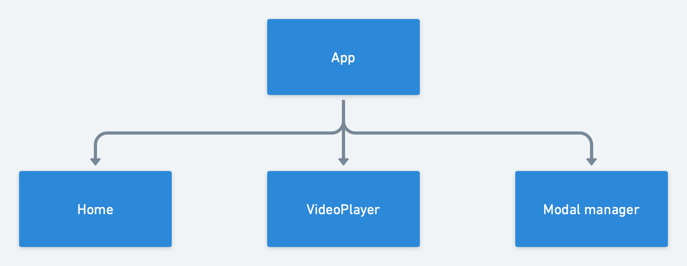
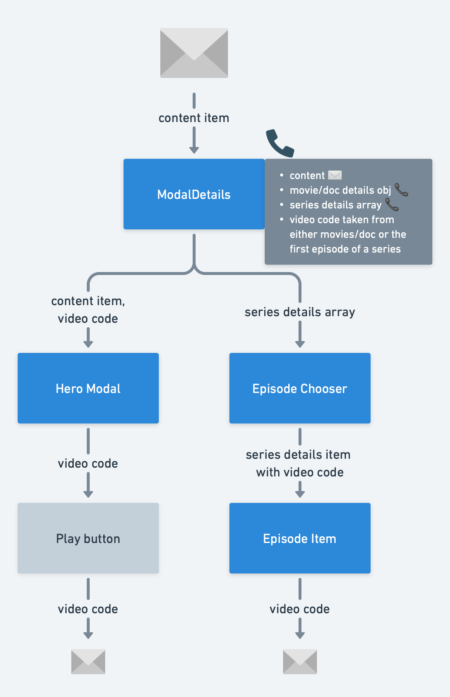
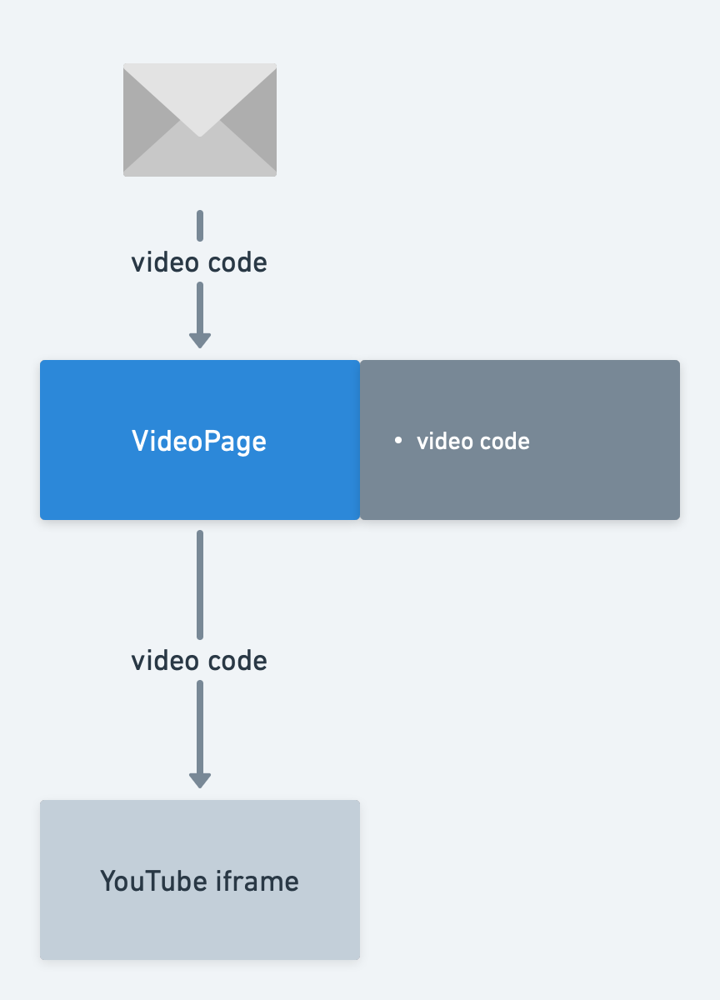

# Natflix

The frontend for project #5 in the TietoEvry Java Course.

# About

This is a dummy frontend meaning that it has hardcoded data. The students must replace the false api calls done using a method called `fakeFetch()` and replace it with the real native `fetch()` method in JavaScript.

- Every tv-series opens information about Seinfield.
- Every movie opens information about Public servant.
- Every documentary opens information about The Last Dance.

# Installation

#0 Clone the repository
#0 Open a terminal and type `npm install` inside the repository folder
#0 Run `npm start` to open the project in `localhost:3000`

# Organization

This is a complex project, thus here are some hierarchy diagrams to understand the project structure.

## Main diagram

The entry point is `App.tsx` it has a browser router for multi-page navigation. Currently it has the Home page and the VideoPlayer page.

In addition, it has a Modal manager to handle modals/popups globally using Content API.

## Home page

The home page has a hero header that showcases the first item and also filters the content by movies, series, or documentaries.

# Modal details

Once the user clicks on the more info button or item card, the modal manager opens this specific component to display the complementary information.

Here the user can click on the play button to play the movie or documentary. If the user selected an tv-series, then the play button will play the first epidode of the first season.

If is a tv-series, the user can click on the dropdown menu to filter epidodes by season and then click on any episode to watch it.

## Video page

The video page takes the video code sent from the play button or episode item inside the modal detail and opens a YouTube video corresponding to the video code.

